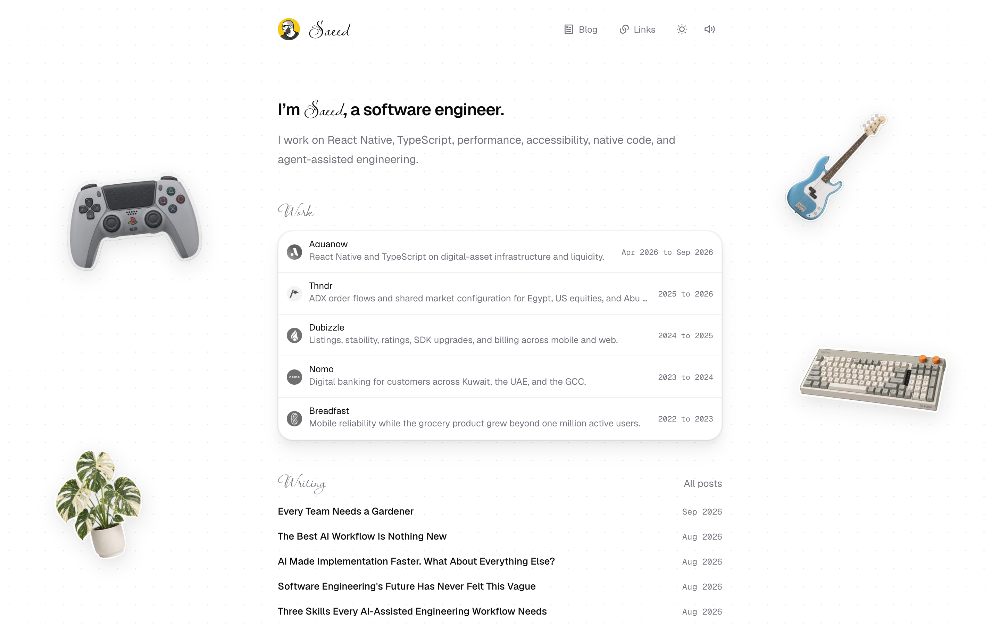
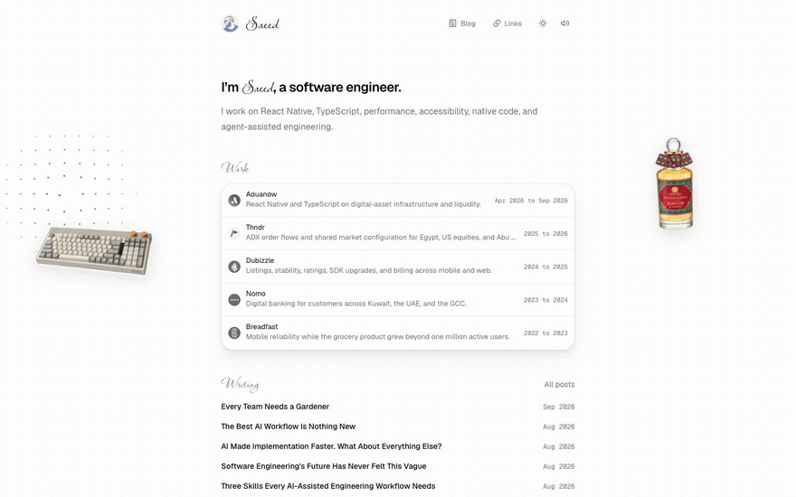
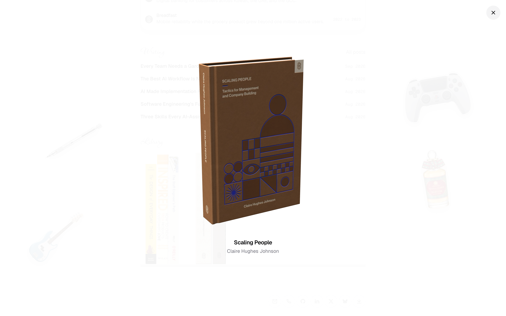
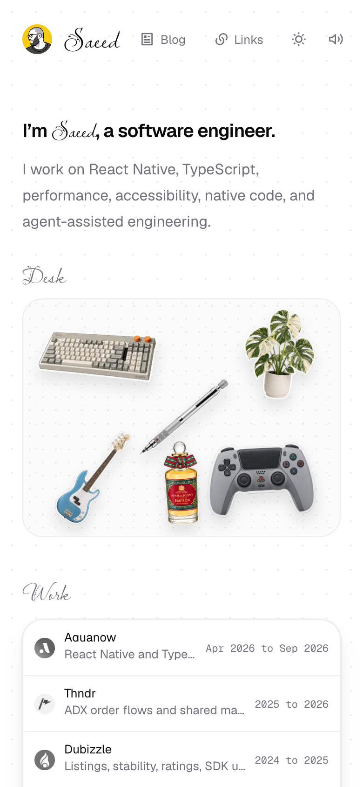

<div align="center">

# Saeed

**A personal site you can pick things up from.**

### [thisissaeed.com →](https://thisissaeed.com)

</div>

<picture>
	<source media="(prefers-color-scheme: dark)" srcset=".github/readme/hero-dark.png" />
	
</picture>

I'm Muhammed Ibrahim, a software engineer who works mostly in React Native. This is my corner of the internet. It has the usual parts: who I am, where I've worked, and what I've written. It also has a desk full of things you can play with.

## What's on the desk

**Six stickers you can throw around.** A mechanical keyboard, a monstera, a bass guitar, a PlayStation controller, a Uni pencil, and a bottle of Babylon perfume sit loose on the page. Drag one and flick it. It keeps sliding. Each one makes its own sound. The keyboard thocks, the plant rustles, the bass plucks an open E, and the perfume sprays. Tap a sticker to read why it's on my desk. The pencil one is about my father.

<p align="center">
	
</p>

**A shelf of books you can pull out.** *The Design of Everyday Things*, *Inspired*, *The Staff Engineer's Path*, *Scaling People*, *An Elegant Puzzle*, and *Where Is My Flying Car?*. Pick one off the shelf, turn it over in your hand, then let it go and watch it slide back into place.

<p align="center">
	
</p>

**A page that answers back.** Links tick under your cursor. The face next to my name follows your pointer with its eyes. The dot grid behind everything moves out of your way. The speaker in the header mutes it all if you'd rather read in silence.

**The rest of me.** Five companies I've shipped apps for, from Breadfast to Aquanow. Twelve posts on React Native and building software with coding agents. A list of 94 links I keep coming back to.

## On your phone too

On a small screen, the stickers gather on a desk of their own. Tap any of them for its story.

<p align="center">
	
</p>

<div align="center">

### Go play with the stickers: [thisissaeed.com](https://thisissaeed.com)

</div>

---

<details>
<summary>Run it locally</summary>

```bash
bun install
bun dev
```

Then open the URL the dev server prints.

</details>
